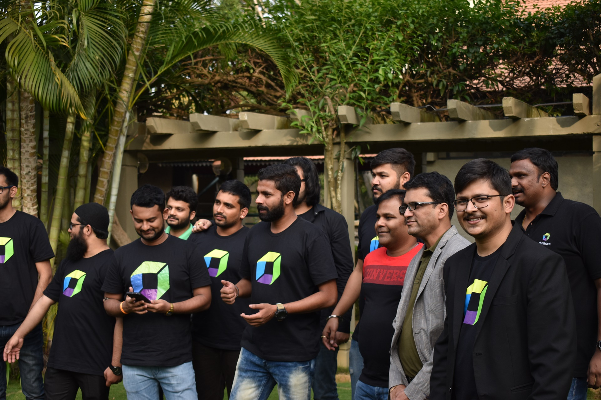

## Hi there 👋

<!--

**Here are some ideas to get you started:**

🙋‍♀️ A short introduction - what is your organization all about?
🌈 Contribution guidelines - how can the community get involved?
👩‍💻 Useful resources - where can the community find your docs? Is there anything else the community should know?
🍿 Fun facts - what does your team eat for breakfast?
🧙 Remember, you can do mighty things with the power of [Markdown](https://guides.github.com/features/mastering-markdown/)
-->

Welocme to Dynaytrace India ACE Services GitHub Organization. Here we have a small story to tell, read along...

Dynatrace India Services is a team of young consultants, developers, architects, and managers who are willing to go the lengths if required to make sure Dynatrace adoption is smoother for their customers around India and VIP countries. As a part of innovation, we always stand in the front line to deliver better experiences and extensions to the customers by extending Dynatrace to the level of SDKs, OpenKit, Mobile Instrumentation, ACE Services. 
We also help customers to engage in their DevOps practices by minimizing operations from their side. Our goal is to help customers to move from traditional software delivery practices to DevSecOps, GitOps, and other modern cultural practices to make their life easier in cooking a great application for their end-users. 

---

### Our Story
This started all the way back in 2016 where Dynatrace was coming to India and adoption was started because of its magical AI. With the help of the Indian sales team and with some partners we were able to pull some great talents in the industry and work on building the team of services experts who deploy and configure Dynatrace in customer locations. We faced many challenges along the way and it was never easy. Every obstacle seemed to be crossable with the skill and experience we had in the APM industry. We did it!! 
Currently, we are 40+ members present in the team with more than 10+ persistent projects all the time. 90% of the members are certified with Dynatrace Associate Certification and Over 30% of them are Professionally Certified. 

---

### Services
- ACE Services
- Deployment and Configuration
- Runbook Automation
- Integration of Keptn
- Run & Maintenance
